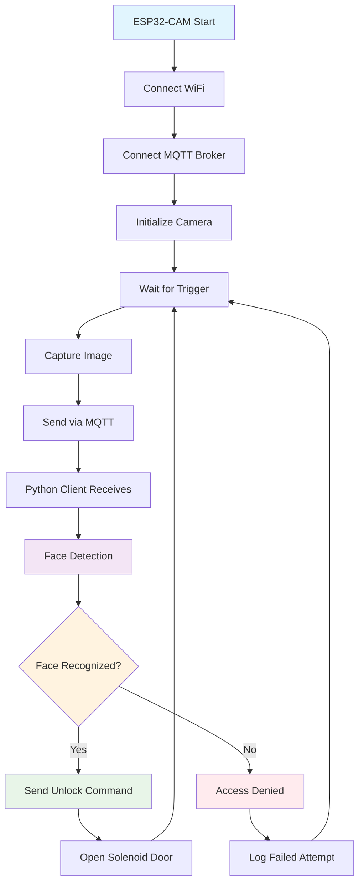

<h1 align="center">📷 ESP32-CAM Face Recognition System</h1>

<p align="center">
  
</p>

<p align="center">
  <em>Sistem keamanan pintar dengan ESP32-CAM, MQTT, dan face recognition untuk kontrol akses otomatis</em>
</p>

<p align="center">
  
  
  
  
  
  
  
  <a href="https://github.com/ficrammanifur/ficrammanifur/blob/main/LICENSE">
      
  </a>
</p>

---

## 📑 Table of Contents

- [✨ Overview](#-overview)
- [🚀 Fitur Utama](#-fitur-utama)
- [🏗️ Arsitektur Sistem](#️-arsitektur-sistem)
- [🛠 Komponen](#-komponen)
- [📁 Struktur Proyek](#-struktur-proyek)
- [⚙️ Instalasi](#️-instalasi)
- [🚀 Cara Menjalankan](#-cara-menjalankan)
- [🔧 Konfigurasi](#-konfigurasi)
- [📊 Monitoring](#-monitoring)
- [🐞 Troubleshooting](#-troubleshooting)
- [🔮 Pengembangan Selanjutnya](#-pengembangan-selanjutnya)
- [🤝 Kontribusi](#-kontribusi)
- [📄 Lisensi](#-lisensi)

---

## ✨ Overview

**ESP32-CAM Face Recognition System** adalah solusi keamanan pintar yang menggunakan ESP32-CAM untuk menangkap gambar, mengirimkannya melalui MQTT, dan melakukan face recognition menggunakan Python dengan OpenCV. Sistem ini dapat digunakan untuk kontrol akses otomatis seperti membuka pintu solenoid berdasarkan pengenalan wajah.

### 🎯 Use Cases
- **Smart Door Lock** - Kontrol akses pintu otomatis
- **Security System** - Monitoring dan logging akses
- **Attendance System** - Sistem absensi berbasis wajah
- **Home Automation** - Integrasi dengan sistem rumah pintar

### 🌟 Keunggulan
- ⚡ **Real-time Processing** - Deteksi wajah secara real-time
- 🔒 **Secure Communication** - Komunikasi MQTT yang aman
- 📱 **Remote Monitoring** - Monitor dari jarak jauh
- 💰 **Cost Effective** - Menggunakan komponen terjangkau
- 🔧 **Easy Integration** - Mudah diintegrasikan dengan sistem lain

---

## 🚀 Fitur Utama

- ✅ **ESP32-CAM Integration**  
  Komunikasi ESP32-CAM dengan MQTT broker untuk pengiriman gambar real-time

- ✅ **Automatic Image Capture**  
  Pengambilan gambar otomatis berdasarkan trigger sensor atau perintah MQTT

- ✅ **Face Recognition**  
  Deteksi dan pengenalan wajah menggunakan OpenCV dan face_recognition library

- ✅ **Access Control**  
  Kontrol solenoid door lock berdasarkan hasil face recognition

- ✅ **Real-time Monitoring**  
  Monitoring sistem secara real-time melalui Python client

- ✅ **Database Management**  
  Manajemen database wajah yang dikenal untuk sistem keamanan

---

## 🏗️ Arsitektur Sistem

### 🔗 Diagram Blok Sistem

```text
┌─────────────────┐    WiFi    ┌──────────────────────┐    MQTT    ┌─────────────────┐
│   ESP32-CAM     │ ◄────────► │   WiFi Router        │ ◄────────► │  MQTT Broker    │
│  • Camera       │            │                      │            │ (Mosquitto)     │
│  • WiFi Module  │            │                      │            │                 │
└─────────────────┘            └──────────────────────┘            └─────────────────┘
         │                                                                   │
         │ GPIO                                                              │ MQTT
         ▼                                                                   ▼
┌─────────────────┐                                              ┌──────────────────────┐
│ Solenoid Door   │                                              │  Python Client       │
│ Lock Control    │                                              │  • OpenCV            │
│                 │                                              │  • Face Recognition  │
└─────────────────┘                                              │  • MQTT Subscriber   │
                                                                 └──────────────────────┘
                                                                          │
                                                                          ▼
                                                                 ┌──────────────────────┐
                                                                 │   Known Faces DB     │
                                                                 │  • Pace.jpg          │
                                                                 │  • Riski.jpg         │
                                                                 │  • Ucin.jpg          │
                                                                 │  • azza.jpg          │
                                                                 └──────────────────────┘
```

### 📊 Flow Diagram



---

## 🛠 Komponen

### 📦 Hardware Requirements

| Komponen | Spesifikasi | Quantity | Fungsi |
|----------|-------------|----------|---------|
| **ESP32-CAM** | AI-Thinker ESP32-CAM | 1 | Kamera dan kontroler utama |
| **Solenoid Door Lock** | 12V DC | 1 | Aktuator pintu |
| **Relay Module** | 5V Single Channel | 1 | Kontrol solenoid |
| **Power Supply** | 5V 3A | 1 | Catu daya sistem |
| **Breadboard** | Half-size | 1 | Prototyping |
| **Jumper Wires** | Male-Female | 10 | Koneksi |

### 💻 Software Requirements

| Software | Version | Platform | Fungsi |
|----------|---------|----------|---------|
| **Arduino IDE** | 2.0+ | Cross-platform | ESP32-CAM programming |
| **Python** | 3.8+ | Cross-platform | Face recognition client |
| **Mosquitto** | 2.0+ | Cross-platform | MQTT broker |
| **OpenCV** | 4.5+ | Python | Computer vision |
| **face_recognition** | 1.3+ | Python | Face detection & recognition |

---

## 📁 Struktur Proyek

```text
ESP32-CAM-Face-Recognition/
├── 📄 README.md                    # Dokumentasi proyek
├── 📋 requirements.txt             # Python dependencies
├── 🤖 MQTT_ESP32_cam/              # Firmware ESP32-CAM
│   ├── MQTT_ESP32_cam.ino         # Kode utama ESP32
│   ├── app_httpd.cpp              # HTTP server handler
│   ├── camera_index.h             # Web interface
│   ├── camera_pins.h              # Pin configuration
│   ├── ci.json                    # CI configuration
│   └── partitions.csv             # Memory partitions
├── 🐍 Python_OpenCV/               # Python face recognition client
│   ├── main.py                    # Script utama Python
│   └── known_faces/               # Database wajah
│       ├── Pace.jpg               # Foto referensi Pace
│       ├── Riski.jpg              # Foto referensi Riski
│       ├── Ucin.jpg               # Foto referensi Ucin
│       └── azza.jpg               # Foto referensi Azza
└── 🖼️ assets/
    ├── esp32cam-preview.png       # Preview sistem
    ├── wiring-diagram.png         # Diagram pengkabelan
    └── demo-video.mp4             # Video demonstrasi
```

---

## ⚙️ Instalasi

### 1. 🔧 Setup Hardware

#### Wiring ESP32-CAM dengan Solenoid Lock

```text
ESP32-CAM    │ Relay Module    │ Solenoid Lock
─────────────┼─────────────────┼───────────────
GPIO 2       │ IN              │ -
5V           │ VCC             │ -
GND          │ GND             │ -
-            │ COM             │ +12V
-            │ NO              │ Solenoid +
GND          │ -               │ Solenoid -
```

### 2. 🤖 Setup ESP32-CAM

#### Install Arduino IDE & Libraries
1. Download Arduino IDE dari [arduino.cc](https://www.arduino.cc/en/software)
2. Install ESP32 board package:
   ```
   File → Preferences → Additional Board Manager URLs:
   https://dl.espressif.com/dl/package_esp32_index.json
   ```
3. Install required libraries:
   - **PubSubClient** by Nick O'Leary
   - **ArduinoJson** by Benoit Blanchon

#### Configure ESP32-CAM Code
Edit `MQTT_ESP32_cam/MQTT_ESP32_cam.ino`:
```cpp
// WiFi Configuration
const char* ssid = "YOUR_WIFI_SSID";
const char* password = "YOUR_WIFI_PASSWORD";

// MQTT Configuration
const char* mqtt_server = "192.168.1.100";  // IP MQTT Broker
const int mqtt_port = 1883;
const char* mqtt_user = "";                 // Optional
const char* mqtt_password = "";             // Optional

// Device Configuration
const char* device_id = "ESP32CAM_001";
const char* topic_image = "esp32cam/image";
const char* topic_command = "esp32cam/command";
const char* topic_status = "esp32cam/status";
```

### 3. 🐍 Setup Python Environment

#### Install Python Dependencies
```bash
cd Python_OpenCV
pip install -r requirements.txt

# Atau install manual
pip install opencv-python paho-mqtt face_recognition numpy pillow
```

#### Setup Known Faces Database
1. Tambahkan foto wajah ke folder `known_faces/`
2. Format: `nama_orang.jpg` (contoh: `john_doe.jpg`)
3. Gunakan foto berkualitas baik dengan pencahayaan cukup
4. Satu wajah per foto, ukuran minimal 200x200 pixels

### 4. 🔌 Setup MQTT Broker

#### Install Mosquitto (Ubuntu/Debian)
```bash
sudo apt update
sudo apt install mosquitto mosquitto-clients

# Start service
sudo systemctl start mosquitto
sudo systemctl enable mosquitto
```

#### Install Mosquitto (Windows)
1. Download dari [mosquitto.org](https://mosquitto.org/download/)
2. Install dan jalankan sebagai service
3. Default port: 1883

#### Test MQTT Connection
```bash
# Terminal 1: Subscribe
mosquitto_sub -h localhost -t esp32cam/+

# Terminal 2: Publish test
mosquitto_pub -h localhost -t esp32cam/command -m "capture"
```

---

## 🚀 Cara Menjalankan

### 1. 🔌 Start ESP32-CAM

1. **Upload Firmware**
   ```
   Arduino IDE → Open MQTT_ESP32_cam.ino
   Board: AI Thinker ESP32-CAM
   Upload Speed: 115200
   Click Upload
   ```

2. **Monitor Serial Output** (Baud Rate: 115200)
   ```
   [INFO] ESP32-CAM Face Recognition System v1.0
   [INFO] Connecting to WiFi: YourWiFi
   [INFO] WiFi connected! IP: 192.168.1.150
   [INFO] Camera initialized successfully
   [INFO] MQTT connecting to: 192.168.1.100:1883
   [INFO] MQTT connected successfully
   [INFO] System ready - waiting for commands
   ```

### 2. 🐍 Run Python Client

```bash
cd Python_OpenCV
python main.py
```

#### Expected Output:
```text
[2024-01-15 14:30:25] INFO: Face Recognition System Started
[2024-01-15 14:30:25] INFO: Loading known faces from database...
[2024-01-15 14:30:25] INFO: Loaded 4 known faces: ['Pace', 'Riski', 'Ucin', 'azza']
[2024-01-15 14:30:25] INFO: MQTT connected to broker: 192.168.1.100:1883
[2024-01-15 14:30:25] INFO: Subscribed to topics: esp32cam/image, esp32cam/status
[2024-01-15 14:30:25] INFO: System ready - waiting for images...
```

### 3. 🎯 Test System

#### Manual Image Capture
```bash
# Send capture command via MQTT
mosquitto_pub -h 192.168.1.100 -t esp32cam/command -m "capture"
```

#### Automatic Face Recognition Flow
1. **Trigger Capture** - ESP32-CAM menangkap gambar
2. **Send via MQTT** - Gambar dikirim ke Python client
3. **Face Detection** - OpenCV mendeteksi wajah dalam gambar
4. **Face Recognition** - Membandingkan dengan database known_faces
5. **Access Control** - Jika dikenali, kirim perintah unlock
6. **Door Control** - ESP32-CAM mengaktifkan relay solenoid

---

## 🔧 Konfigurasi

### ⚙️ ESP32-CAM Configuration

Edit `MQTT_ESP32_cam.ino`:

```cpp
// Camera Settings
#define CAMERA_MODEL_AI_THINKER
#define PWDN_GPIO_NUM     32
#define RESET_GPIO_NUM    -1
#define XCLK_GPIO_NUM      0
#define SIOD_GPIO_NUM     26
#define SIOC_GPIO_NUM     27

// Image Quality Settings
#define IMAGE_QUALITY     10    // 0-63, lower = better quality
#define IMAGE_SIZE        FRAMESIZE_VGA  // 640x480
#define JPEG_QUALITY      80    // 0-100, higher = better quality

// MQTT Topics
#define TOPIC_IMAGE       "esp32cam/image"
#define TOPIC_COMMAND     "esp32cam/command"
#define TOPIC_STATUS      "esp32cam/status"
#define TOPIC_UNLOCK      "esp32cam/unlock"

// Hardware Pins
#define RELAY_PIN         2     // GPIO untuk kontrol relay
#define LED_PIN           4     // GPIO untuk LED indikator
```

### 🐍 Python Client Configuration

Edit `Python_OpenCV/main.py`:

```python
# MQTT Configuration
MQTT_BROKER = "192.168.1.100"
MQTT_PORT = 1883
MQTT_USERNAME = ""  # Optional
MQTT_PASSWORD = ""  # Optional

# Topics
TOPIC_IMAGE = "esp32cam/image"
TOPIC_COMMAND = "esp32cam/command"
TOPIC_STATUS = "esp32cam/status"
TOPIC_UNLOCK = "esp32cam/unlock"

# Face Recognition Settings
FACE_RECOGNITION_TOLERANCE = 0.6  # Lower = more strict
FACE_DETECTION_MODEL = "hog"      # 'hog' or 'cnn'
KNOWN_FACES_PATH = "known_faces/"

# Image Processing
IMAGE_RESIZE_FACTOR = 0.25        # Resize for faster processing
FACE_LOCATIONS_MODEL = "hog"      # 'hog' or 'cnn'

# Access Control
UNLOCK_DURATION = 5               # Seconds to keep door unlocked
MAX_FAILED_ATTEMPTS = 3           # Max failed attempts before lockout
LOCKOUT_DURATION = 300            # Lockout duration in seconds
```

### 🔒 Security Configuration

```python
# Security Settings
ENABLE_LOGGING = True
LOG_FILE = "access_log.txt"
ENABLE_EMAIL_ALERTS = False
EMAIL_SMTP_SERVER = "smtp.gmail.com"
EMAIL_PORT = 587
EMAIL_USERNAME = "your_email@gmail.com"
EMAIL_PASSWORD = "your_app_password"
ALERT_EMAIL = "security@yourcompany.com"

# Face Database Management
AUTO_UPDATE_DATABASE = False      # Auto-add new faces
CONFIDENCE_THRESHOLD = 0.8        # Minimum confidence for auto-add
BACKUP_DATABASE = True            # Backup known faces
BACKUP_INTERVAL = 86400           # Backup every 24 hours
```

---

## 📊 Monitoring

### 🖥️ Python Client Output

```text
[2024-01-15 14:30:26] INFO: Image received from ESP32-CAM (Size: 15.2 KB)
[2024-01-15 14:30:26] INFO: Processing image for face detection...
[2024-01-15 14:30:26] INFO: Found 1 face(s) in image
[2024-01-15 14:30:26] INFO: Face recognition in progress...
[2024-01-15 14:30:26] SUCCESS: Face recognized as 'Pace' (Confidence: 0.85)
[2024-01-15 14:30:26] INFO: Sending unlock command to ESP32-CAM
[2024-01-15 14:30:26] INFO: Access granted - Door unlocked for 5 seconds
─────────────────────────────────────────────────────
[2024-01-15 14:32:15] INFO: Image received from ESP32-CAM (Size: 14.8 KB)
[2024-01-15 14:32:15] INFO: Processing image for face detection...
[2024-01-15 14:32:15] INFO: Found 1 face(s) in image
[2024-01-15 14:32:15] WARNING: Unknown face detected (Confidence: 0.45)
[2024-01-15 14:32:15] INFO: Access denied - Face not recognized
[2024-01-15 14:32:15] INFO: Failed attempt logged
─────────────────────────────────────────────────────
```

### 🤖 ESP32-CAM Serial Monitor

Baud Rate: **115200**

```text
[INFO] ESP32-CAM Face Recognition System v1.0
[INFO] Camera initialized: OV2640
[INFO] WiFi connected: 192.168.1.150
[INFO] MQTT connected: 192.168.1.100:1883
[INFO] System ready
─────────────────────────────────────────────────────
[14:30:26] Command received: capture
[14:30:26] Capturing image... (Quality: 10, Size: VGA)
[14:30:26] Image captured successfully (15.2 KB)
[14:30:26] Publishing to topic: esp32cam/image
[14:30:26] Image sent via MQTT
[14:30:26] Unlock command received
[14:30:26] Activating relay - Door unlocked
[14:30:31] Relay deactivated - Door locked
─────────────────────────────────────────────────────
[14:32:15] Motion detected - Auto capture triggered
[14:32:15] Image captured and sent
[14:32:15] No unlock command received - Access denied
─────────────────────────────────────────────────────
```

### 📈 System Statistics

```python
# Access Log Example
def log_access_attempt(name, success, confidence, timestamp):
    log_entry = {
        'timestamp': timestamp,
        'name': name,
        'success': success,
        'confidence': confidence,
        'ip_address': get_client_ip()
    }
    
    with open('access_log.json', 'a') as f:
        json.dump(log_entry, f)
        f.write('\n')

# Statistics Dashboard
def generate_statistics():
    stats = {
        'total_attempts': count_total_attempts(),
        'successful_access': count_successful_access(),
        'failed_attempts': count_failed_attempts(),
        'unique_faces': count_unique_faces(),
        'average_confidence': calculate_avg_confidence(),
        'peak_hours': analyze_peak_hours()
    }
    return stats
```

---

## 🐞 Troubleshooting

### ❌ Common Issues & Solutions

#### **1. ESP32-CAM Not Connecting to WiFi**

**Symptoms:**
```text
[ERROR] WiFi connection failed
[ERROR] Retrying WiFi connection...
```

**Solutions:**
- ✅ Periksa SSID dan password WiFi
- ✅ Pastikan WiFi menggunakan 2.4GHz (bukan 5GHz)
- ✅ Cek jarak ESP32-CAM ke router
- ✅ Reset ESP32-CAM dan coba lagi

```cpp
// Enhanced WiFi connection with retry
void connectWiFi() {
  WiFi.begin(ssid, password);
  Serial.print("Connecting to WiFi");
  
  int attempts = 0;
  while (WiFi.status() != WL_CONNECTED && attempts < 20) {
    delay(500);
    Serial.print(".");
    attempts++;
    
    if (attempts % 10 == 0) {
      Serial.println();
      Serial.println("Retrying WiFi connection...");
      WiFi.disconnect();
      delay(1000);
      WiFi.begin(ssid, password);
    }
  }
  
  if (WiFi.status() == WL_CONNECTED) {
    Serial.println();
    Serial.print("✅ WiFi connected! IP: ");
    Serial.println(WiFi.localIP());
  } else {
    Serial.println();
    Serial.println("❌ WiFi connection failed");
  }
}
```

#### **2. Camera Initialization Failed**

**Symptoms:**
```text
[ERROR] Camera init failed with error 0x20001
[ERROR] Camera probe failed
```

**Solutions:**
- ✅ Periksa koneksi kamera ke ESP32-CAM
- ✅ Pastikan power supply cukup (minimal 5V 2A)
- ✅ Coba reset ESP32-CAM
- ✅ Periksa pin configuration

```cpp
// Enhanced camera initialization
bool initCamera() {
  camera_config_t config;
  config.ledc_channel = LEDC_CHANNEL_0;
  config.ledc_timer = LEDC_TIMER_0;
  config.pin_d0 = Y2_GPIO_NUM;
  config.pin_d1 = Y3_GPIO_NUM;
  // ... other pin configurations
  
  config.xclk_freq_hz = 20000000;
  config.pixel_format = PIXFORMAT_JPEG;
  config.frame_size = FRAMESIZE_VGA;
  config.jpeg_quality = 10;
  config.fb_count = 1;
  
  esp_err_t err = esp_camera_init(&config);
  if (err != ESP_OK) {
    Serial.printf("❌ Camera init failed with error 0x%x", err);
    return false;
  }
  
  Serial.println("✅ Camera initialized successfully");
  return true;
}
```

#### **3. MQTT Connection Issues**

**Symptoms:**
```text
[ERROR] MQTT connection failed, rc=-2
[ERROR] Failed to connect to MQTT broker
```

**Solutions:**
- ✅ Periksa IP address MQTT broker
- ✅ Pastikan Mosquitto service berjalan
- ✅ Cek firewall settings
- ✅ Test dengan MQTT client tools

```bash
# Test MQTT broker
mosquitto_pub -h 192.168.1.100 -t test -m "hello"
mosquitto_sub -h 192.168.1.100 -t test

# Check Mosquitto status (Linux)
sudo systemctl status mosquitto

# Restart Mosquitto if needed
sudo systemctl restart mosquitto
```

#### **4. Face Recognition Not Working**

**Symptoms:**
- Python client tidak mendeteksi wajah
- Akurasi recognition rendah
- Error saat loading known faces

**Solutions:**
- ✅ Periksa kualitas gambar dari ESP32-CAM
- ✅ Pastikan pencahayaan cukup
- ✅ Gunakan foto referensi berkualitas baik
- ✅ Sesuaikan tolerance parameter

```python
# Enhanced face recognition with error handling
def recognize_faces(image):
    try:
        # Resize image for faster processing
        small_frame = cv2.resize(image, (0, 0), fx=0.25, fy=0.25)
        rgb_small_frame = small_frame[:, :, ::-1]
        
        # Find face locations
        face_locations = face_recognition.face_locations(rgb_small_frame)
        
        if not face_locations:
            print("⚠️ No faces detected in image")
            return None, None
        
        # Get face encodings
        face_encodings = face_recognition.face_encodings(rgb_small_frame, face_locations)
        
        for face_encoding in face_encodings:
            # Compare with known faces
            matches = face_recognition.compare_faces(known_face_encodings, face_encoding, tolerance=0.6)
            face_distances = face_recognition.face_distance(known_face_encodings, face_encoding)
            
            best_match_index = np.argmin(face_distances)
            
            if matches[best_match_index]:
                name = known_face_names[best_match_index]
                confidence = 1 - face_distances[best_match_index]
                return name, confidence
        
        return "Unknown", 0.0
        
    except Exception as e:
        print(f"❌ Face recognition error: {e}")
        return None, None
```

#### **5. Solenoid Door Lock Not Working**

**Symptoms:**
- Relay tidak mengaktifkan solenoid
- Solenoid tidak cukup kuat
- Door lock tidak merespon

**Solutions:**
- ✅ Periksa wiring relay ke ESP32-CAM
- ✅ Pastikan power supply solenoid cukup (12V)
- ✅ Test relay secara manual
- ✅ Cek GPIO pin configuration

```cpp
// Enhanced relay control with feedback
void controlDoorLock(bool unlock) {
  if (unlock) {
    Serial.println("🔓 Unlocking door...");
    digitalWrite(RELAY_PIN, HIGH);
    digitalWrite(LED_PIN, HIGH);  // Visual indicator
    
    // Keep unlocked for specified duration
    delay(UNLOCK_DURATION * 1000);
    
    digitalWrite(RELAY_PIN, LOW);
    digitalWrite(LED_PIN, LOW);
    Serial.println("🔒 Door locked");
  } else {
    digitalWrite(RELAY_PIN, LOW);
    digitalWrite(LED_PIN, LOW);
    Serial.println("🔒 Door remains locked");
  }
}

// Test relay function
void testRelay() {
  Serial.println("Testing relay...");
  
  for (int i = 0; i < 3; i++) {
    digitalWrite(RELAY_PIN, HIGH);
    delay(500);
    digitalWrite(RELAY_PIN, LOW);
    delay(500);
  }
  
  Serial.println("✅ Relay test complete");
}
```

---

## 🔮 Pengembangan Selanjutnya

### 🎯 Version 2.0 (Planned)

- [ ] **Web Dashboard** - Interface web untuk monitoring dan konfigurasi
- [ ] **Mobile App** - Aplikasi Android/iOS untuk kontrol remote
- [ ] **Database Integration** - MySQL/PostgreSQL untuk logging
- [ ] **Multi-Camera Support** - Support multiple ESP32-CAM
- [ ] **Cloud Integration** - AWS/Google Cloud untuk backup

### 🎯 Version 3.0 (Future)

- [ ] **AI Enhancement** - Deep learning untuk akurasi lebih tinggi
- [ ] **Voice Recognition** - Kombinasi face + voice recognition
- [ ] **Gesture Control** - Kontrol dengan gesture tangan
- [ ] **Biometric Integration** - Fingerprint + face recognition
- [ ] **IoT Integration** - Integrasi dengan smart home systems

### 🔧 Technical Improvements

- [ ] **Encryption** - End-to-end encryption untuk komunikasi MQTT
- [ ] **Authentication** - User authentication dan authorization
- [ ] **Load Balancing** - Multiple MQTT brokers untuk reliability
- [ ] **Edge Computing** - On-device face recognition untuk privacy
- [ ] **Real-time Streaming** - Live video streaming capability

### 📊 Analytics & Reporting

- [ ] **Access Analytics** - Detailed access reports dan statistics
- [ ] **Anomaly Detection** - Deteksi aktivitas mencurigakan
- [ ] **Predictive Analytics** - Prediksi pola akses
- [ ] **Integration APIs** - RESTful APIs untuk integrasi
- [ ] **Compliance Reporting** - Reports untuk audit keamanan

---

## 🤝 Kontribusi

Kontribusi dari komunitas sangat diterima! Mari bersama-sama mengembangkan sistem keamanan yang lebih baik.

### 📋 How to Contribute

1. **🍴 Fork** repository ini
2. **🌿 Create** feature branch (`git checkout -b feature/AmazingFeature`)
3. **💾 Commit** changes (`git commit -m 'Add some AmazingFeature'`)
4. **📤 Push** to branch (`git push origin feature/AmazingFeature`)
5. **🔄 Open** Pull Request

### 🎯 Areas for Contribution

#### 🔬 Research & Development
- [ ] **AI/ML Improvements** - Enhance face recognition accuracy
- [ ] **Security Enhancements** - Implement advanced security features
- [ ] **Performance Optimization** - Optimize system performance
- [ ] **New Features** - Add innovative features

#### 💻 Software Development
- [ ] **Web Dashboard** - Develop web-based management interface
- [ ] **Mobile Apps** - Create Android/iOS applications
- [ ] **API Development** - Build RESTful APIs
- [ ] **Database Integration** - Implement database solutions

#### 🔧 Hardware Development
- [ ] **PCB Design** - Create custom PCB designs
- [ ] **3D Printing** - Design 3D printed enclosures
- [ ] **Sensor Integration** - Add additional sensors
- [ ] **Power Management** - Improve power efficiency

#### 📚 Documentation & Education
- [ ] **Video Tutorials** - Create instructional videos
- [ ] **Translation** - Translate documentation
- [ ] **Case Studies** - Document real-world implementations
- [ ] **Best Practices** - Share implementation guidelines

---

## 👨‍💻 Pengembang

**Ficram Manifur**
- 🐙 GitHub: [@ficrammanifur](https://github.com/ficrammanifur)
- 🌐 Portfolio: [ficrammanifur.github.io](https://ficrammanifur.github.io/ficram-portfolio)
- 📧 Email: ficramm@gmail.com

### 🙏 Acknowledgments

- **ESP32 Community** - Untuk dokumentasi dan library yang luar biasa
- **OpenCV Team** - Computer vision library yang powerful
- **face_recognition Library** - Simple dan effective face recognition
- **Eclipse Mosquitto** - Reliable MQTT broker
- **Arduino Community** - Ecosystem yang mendukung maker projects
- **Open Source Contributors** - Inspirasi dan kolaborasi

---

## 📄 Lisensi

Proyek ini dilisensikan di bawah **MIT License** - lihat file [LICENSE](LICENSE) untuk detail lengkap.

```text
MIT License

Copyright (c) 2025 ficrammanifur

Permission is hereby granted, free of charge, to any person obtaining a copy
of this software and associated documentation files (the "Software"), to deal
in the Software without restriction, including without limitation the rights
to use, copy, modify, merge, publish, distribute, sublicense, and/or sell
copies of the Software, and to permit persons to whom the Software is
furnished to do so, subject to the following conditions:

The above copyright notice and this permission notice shall be included in all
copies or substantial portions of the Software.

THE SOFTWARE IS PROVIDED "AS IS", WITHOUT WARRANTY OF ANY KIND, EXPRESS OR
IMPLIED, INCLUDING BUT NOT LIMITED TO THE WARRANTIES OF MERCHANTABILITY,
FITNESS FOR A PARTICULAR PURPOSE AND NONINFRINGEMENT. IN NO EVENT SHALL THE
AUTHORS OR COPYRIGHT HOLDERS BE LIABLE FOR ANY CLAIM, DAMAGES OR OTHER
LIABILITY, WHETHER IN AN ACTION OF CONTRACT, TORT OR OTHERWISE, ARISING FROM,
OUT OF OR IN CONNECTION WITH THE SOFTWARE OR THE USE OR OTHER DEALINGS IN THE
SOFTWARE.
```

---

<div align="center">

**📷 Smart Security with ESP32-CAM & Face Recognition**

**⚡ Built with ESP32-CAM, Python, OpenCV & MQTT**

**🔒 Making Access Control Smarter and Safer**

**⭐ Star this repo if you like it!**

<p><a href="#top">⬆ Kembali ke Atas</a></p>

</div>
